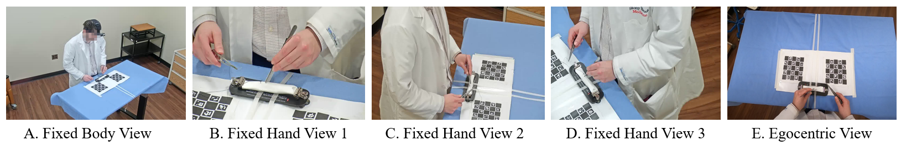

# open-surgical-skills
Official code implementation of the paper ["Behavior-based Skill Assessment for Open Surgery from Multi-view and Egocentric Videos"](https://openaccess.thecvf.com/content/CVPR2026W/SAUAFG/papers/Miao_Behavior-Based_Skill_Assessment_for_Open_Surgery_from_Multi-View_and_Egocentric_CVPRW_2026_paper.pdf) published in CVPR 2026 Workshop: SAUAFG



We provide the code for 2D and 3D pose estimation, for detecting head movements from the egocentric view, for computing the behavior metrics from the estimated poses, and for skill prediction from these metrics.

## Installation

```
pip install -r requirements.txt
pip install -e third_party/EasyMocap
```

The code under `third_party/EasyMocap` is distributed under its own license, see [third_party/README.md](third_party/README.md).

## Data organization

All scripts take `--base_dir`, the dataset root (`$DATA_ROOT` below). The videos of each subject are under `$DATA_ROOT/Data/{group}/{subj_folder}/Videos`, where the group is `Students`, `Residents` or `Attendings`. `Cam1` is the body-view camera, `Cam2`-`Cam4` are the hand-view cameras, and `Ego` is the egocentric camera. See [docs/pose_and_triangulation.md](docs/pose_and_triangulation.md) for the full folder layout.

All of our pose estimation is done at 5 fps, i.e. on every 6th frame of the 30 fps videos. Decode the videos of a subject into `Images/{Cam}` with:

```
bash scripts/decode_frames.sh $DATA_ROOT {group} {subj_folder}
```

## 1. 2D pose estimation

**Hand pose.** We use [MediaPipe](https://ai.google.dev/edge/mediapipe/solutions/vision/gesture_recognizer). The model file is downloaded automatically on the first run.

```
python pose/hand_pose_mediapipe.py --base_dir $DATA_ROOT --group {group} --subj_folder {subj_folder} --fps 5
```

This processes all exocentric views. Add `--camera Ego` for the egocentric view and `--vis` to save visualizations. The results are saved in `handpose/handpose_{Cam}.pkl`.

Optionally, for the exocentric views, the hands that MediaPipe missed can be recovered by tracking the keypoints from neighboring frames with [CoTracker](https://github.com/facebookresearch/co-tracker) (commit `8d36403`, checkpoint `cotracker_stride_4_wind_8.pth`):

```
python pose/filter_handpose_and_track.py --base_dir $DATA_ROOT --ckpt_path {cotracker checkpoint} --group {group} --subj_folder {subj_folder} --fps 5
```

The results are saved in `handpose/handpose_{Cam}_track.pkl`.

For the egocentric view, interpolate the missing detections with:

```
python pose/smooth_hand2d.py --base_dir $DATA_ROOT
```

The results are saved in `handpose/handpose_Ego_smoothed.pkl`.

**Body pose.** We use [AlphaPose](https://github.com/MVIG-SJTU/AlphaPose) with the Halpe-26 ResNet-50 model on the body-view camera. Under the AlphaPose folder, run:

```
python scripts/demo_inference.py --cfg configs/halpe_26/resnet/256x192_res50_lr1e-3_1x.yaml --checkpoint {path to halpe26_fast_res50_256x192.pth} --indir $DATA_ROOT/Data/{group}/{subj_folder}/Images/Cam1 --outdir $DATA_ROOT/Data/{group}/{subj_folder}/bodypose --detector yolo
```

AlphaPose sometimes outputs multiple detections for one image. Keep the first one with:

```
python pose/alphapose/clean_detections.py --base_dir $DATA_ROOT --group {group} --subj_folder {subj_folder}
```

The results are saved in `bodypose/alphapose-results-cleaned.json`.

## 2. 3D pose estimation

**Hand pose.** We triangulate the 2D hand poses of the exocentric views with our modified copy of [EasyMocap](https://github.com/zju3dv/EasyMocap). The camera parameters (`intri.yml` and `extri.yml`, in the format of EasyMocap) are expected under `Calibration/` of the subject folder. Under `third_party/EasyMocap`, run:

```
python apps/demo/hand_get3d.py $DATA_ROOT/Data/{group}/{subj_folder} --out $DATA_ROOT/Data/{group}/{subj_folder}/vis_3d --annotfolder handpose --imagefolder Images --sub Cam1 Cam2 Cam3 Cam4 --sub_vis Cam2 Cam3 Cam4 --annot_file handpose.pkl --cam_as_world Cam3
```

Use `--annot_file handpose_track.pkl` to triangulate the poses after the CoTracker step, and add `--vis_repro` to visualize the 3D pose and its reprojections. The results are saved in `handpose/keypoints_3d.pickle`.

Then smooth the 3D hand pose and interpolate the missing poses:

```
python triangulation/smooth_hand3d.py --base_dir $DATA_ROOT --groups {group} --subj_name {subj_folder} --annot_file handpose.pkl
```

The results are saved in `handpose/keypoints_3d_smoothed.pickle`.

**Body pose.** We lift the 2D body pose to 3D with [MotionBERT](https://github.com/Walter0807/MotionBERT). Under the MotionBERT folder, run:

```
python infer_wild.py --json_path $DATA_ROOT/Data/{group}/{subj_folder}/bodypose/alphapose-results-cleaned.json --out_path $DATA_ROOT/Data/{group}/{subj_folder}/bodypose --evaluate {path to FT_MB_lite_MB_ft_h36m_global_lite.bin}
```

The results are saved in `bodypose/X3D.npy`.

## 3. Egocentric head movement detection

We estimate the camera motion between consecutive egocentric frames. Keypoints are extracted with SuperPoint and matched with [LightGlue](https://github.com/cvg/LightGlue) (install it by following its instructions), a homography is estimated from the matches, and the displacement of the image corners is used as the movement score:

```
python metrics/ego/compute_head_movement_ego.py --base_dir $DATA_ROOT
```

The scores of all subjects are saved in `Analysis/head_movement_scores_ego.pkl`. Add `--visualize` to save the matched frame pairs.

## 4. Behavior metrics

The behavior metrics are computed per suturing cycle from the estimated poses. They need the cycle timestamps and the dominant hand of each subject, and the aggregation also needs the expert ratings. See [docs/behavior_metrics.md](docs/behavior_metrics.md) for the format of these annotation files, which are expected under `$DATA_ROOT/Analysis`.

**Exocentric views**, from the 3D hand pose and the 3D body pose:

```
python metrics/exo/compute_hand_distance.py --base_dir $DATA_ROOT      # hand travel distance
python metrics/exo/compute_hand_smoothness.py --base_dir $DATA_ROOT    # hand motion smoothness (SPARC)
python metrics/exo/compute_hand_stability.py --base_dir $DATA_ROOT     # hand motion consistency across cycles (Procrustes)
python metrics/exo/compute_body_movements.py --base_dir $DATA_ROOT     # number of large body movements
python metrics/exo/aggregate_and_correlate.py --base_dir $DATA_ROOT    # aggregate into Analysis/aggregated_metrics.xlsx
```

`compute_hand_distance.py` needs to be run first, as it also splits the hand poses into cycles for the next two scripts.

**Egocentric view**, from the 2D hand pose and the head movement scores:

```
python metrics/ego/split_keypoints_by_cycle.py --base_dir $DATA_ROOT        # split the hand poses into cycles
python metrics/ego/compute_hand_smoothness_ego.py --base_dir $DATA_ROOT     # hand motion smoothness (SPARC)
python metrics/ego/compute_hand_stability_ego.py --base_dir $DATA_ROOT      # hand motion consistency across cycles (Procrustes)
python metrics/ego/count_head_movements.py --base_dir $DATA_ROOT            # number of large head movements per cycle
python metrics/ego/aggregate_and_correlate_ego.py --base_dir $DATA_ROOT     # aggregate into Analysis/aggregated_metrics_ego.xlsx
```

**Skill prediction.** With the aggregated metrics, the regression models are trained and evaluated with repeated 4-fold cross-validation:

```
python predict/predict_exo.py --base_dir $DATA_ROOT
python predict/predict_ego.py --base_dir $DATA_ROOT
```

The results are saved under `Analysis/Prediction` and `Analysis/Prediction_Ego`.
